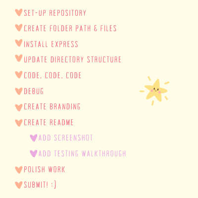

<p align="center">

</p>

[](https://opensource.org/licenses/MIT)
[](https://nodejs.org/en)
[](https://expressjs.com/)
[](https://heroku.com/)
[](https://canva.com/) 
[](https://canva.com/) 


**CURRENTLY HIBERNATING - COME BACK SOON TO SEE FINISHED README!** 

### 

  - [OVERVIEW](#overview)
    - [user story](#user-story)
    - [acceptance criteria](#acceptance-criteria)
    - [the bear-y list](#beary-list)
  - [INSTALLATION](#installation)
  - [USAGE](#usage)
    - [screenshot](#screenshot)
    - [demo](#demo)
  - [TESTING](#testing)
  - [SOURCES](#sources)
  - [LICENSE](#license)
  - [LINKS](#links)
  - [CONNECT](#connect)


### 
The [Bear in Mind NOTE TAKER]() is an application that can be used to write and save notes.

This application will use an [Express.js](https://expressjs.com) back end and will **save** and **retrieve** note data from a `JSON file`.

### 


### 


### 



### 

The application is invoked using the following commands:

*Clone the repository in your local development enviorment.*

```
git clone https://github.com/christiecamp/bear-taker.git
```

*Navigate to the command line and input:*

```javascript
node index.js
```
```javascript
npm init -y
```
```javascript
npm i express
```
```javascript
npm i uuidv4
```
```javascript
npm run start
```

### 

**INSTRUCTIONS:**

1. 
2. 
3. 
3. 
4. 


### 

The below screenshot demonstrates the application writing, saving, and deleting user notes.


### 

The included demo demonstrates the functionality and testing of the application.

### Walkthrough


### Testing


### 

Insomnia provides a way to test the app, all within a test suite.


### 

Here's a list of technologies used:

1. [Node.js]() - is an open-source, cross-platform JavaScript runtime environment.

2. [Express.js]((https://expressjs.com)) - a minimal and flexible Node.js web application framework that provides a robust set of features for web and mobile applications.

3. [Insomnia](https://insomnia.rest/) - open source API used for testing and development in local host.

3. [Heroku](https://heroku.com) - used to deploy, manage, and scale the application.


### 

 [MIT License](./LICENSE)


### 

[GitHub Repository](https://github.com/christiecamp/bear-taker)

[Deployed Application](https://bear-taker-5e98aabde130.herokuapp.com/)

[Video Demo]()

[Testing]()


### 

[](https://github.com/christiecamp) 

<a href = "mailto:abc@example.com?subject = Feedback&body = Message"> <3 </a>


<!-- <a href="https://www.christiecamp.com"></a> -->

  